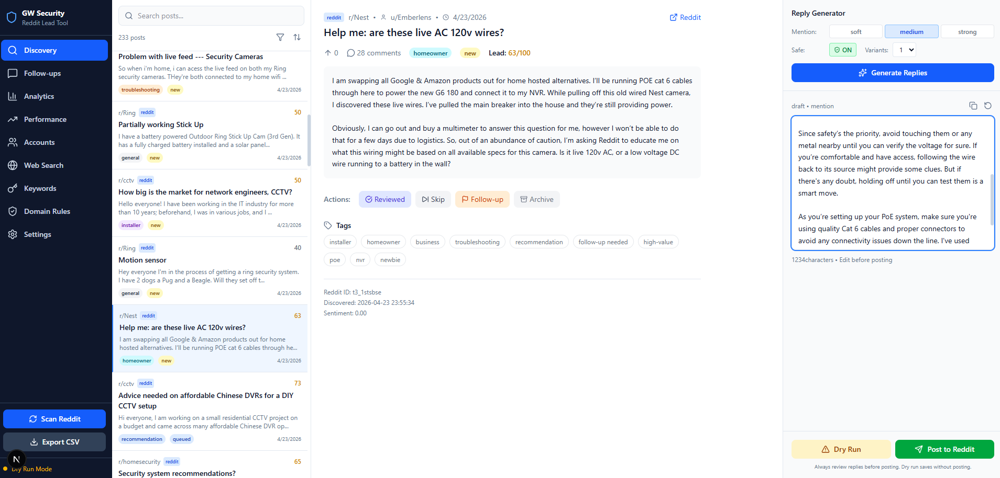
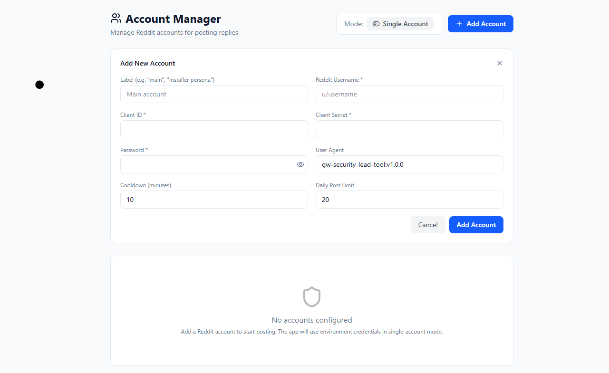

# GW Security Reddit Response Tool

Internal human-in-the-loop tool used by GW Security staff to find and respond to relevant questions on Reddit about IP cameras, NVR/DVR systems, Blue Iris, and home/business security setups.

This repository exists to document the tool for the Reddit API access review. The source code is internal and not published here; it runs locally on operator workstations and is not publicly hosted. Source can be made available under NDA on request — contact support@gwsecurityusa.com.

## What the tool does

The tool is a workflow layer for a small team of GW Security employees who answer technical security-camera questions on Reddit from their personal accounts. Every comment posted by the tool is reviewed and explicitly approved by a human operator — there is no autonomous posting path.

### Workflow

1. **Search.** The tool periodically queries Reddit's public API for posts in pre-configured subreddits matching keyword sets related to security cameras, NVR/DVR setups, Blue Iris, motion detection, and IP camera troubleshooting.
2. **Surface.** Matching posts appear in an internal dashboard for an operator to triage. The dashboard shows the post, score, comments, and a draft reply for context.
3. **Review and edit.** The operator reads the post, edits or rewrites the draft, and decides whether a reply would actually be helpful. Most surfaced posts are skipped.
4. **Post.** When the operator clicks "Post," a single comment is submitted under that operator's designated Reddit account.
5. **Audit.** Every posted comment is logged with a link to the original post and the posted comment for later verification.

### Examples of posts the tool helps respond to

- "Blue Iris keeps dropping my Hikvision camera every few hours — settings to check?" → operator replies with substream/keyframe interval settings.
- "Best PoE switch for 8 cameras on a budget?" → operator recommends a model with the right power budget for the cameras described.
- "Why is my NVR recording missing the last 30 seconds before motion?" → operator explains pre-record buffer settings.

## Screenshots

### Lead dashboard
Operators triage incoming posts that matched the configured keyword sets and subreddits.

### Draft and reply review
Each post opens to a review screen where the operator edits or rewrites the draft and decides whether to post. Nothing leaves the tool without a human clicking Post.

### Account settings
Each operator's Reddit credentials are configured per-account so posted comments come from the correct user.

## Safeguards

- **Human in the loop on every comment.** No auto-post path exists. The Post button is the only way a comment reaches Reddit.
- **API rate limiting.** Requests are gated to >1 second per call via snoowrap's built-in throttling.
- **Per-account audit log.** Every post is recorded with the source post URL, the posted comment URL, the operator account, and the reply text.
- **Public data only.** The tool reads public posts via the official Reddit API. It does not scrape, log in via web sessions, or access private content.
- **Limited account count.** Operated by GW Security staff under a small set of named accounts, all added as developers on a single registered script app.

## Why not Devvit?

Devvit is a platform for apps that run inside a single subreddit's experience (mod tools, custom post types, blocks). This tool's shape is the opposite: it's an external operator-facing dashboard that searches across multiple subreddits where GW Security has no moderator relationship, and lets internal staff review and respond from their own user accounts.

Specifically, Devvit does not provide:
- Cross-subreddit search and aggregation in a single operator UI.
- An external dashboard accessible to internal staff who are not moderators of the target subreddits.
- Integration with internal company workflows (account assignment, audit logs, performance reporting).
- Comment posting from an operator's own user account rather than an installed-app context.

## Contact

GW Security — support@gwsecurityusa.com
[gwsecurityusa.com](https://gwsecurityusa.com)
